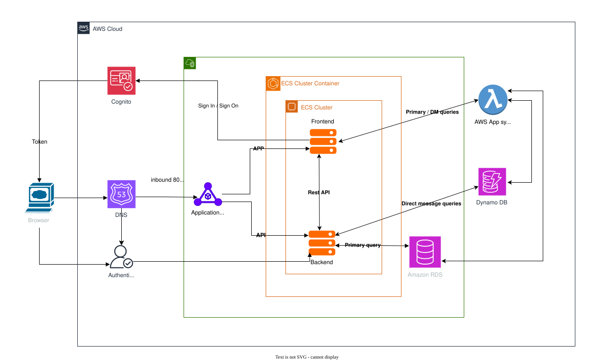

# cruddur-infra

Automated, Production-Ready Infrastructure as Code (IaC) deployment for the Cruddur platform.

---

## :cloud: Overview

> This repository contains code and configuration for deploying, automating, and operating the _Cruddur_ application's cloud infrastructure using **Terraform**, **Python**, and **Shell scripts** (with a focus on AWS and containerized workloads). It demonstrates modern DevOps best practices—automation, modularization, security, and observability.

## :triangular_ruler: Architecture



- **Cloud Provider**: AWS (`VPC`, `ECS Fargate`, `RDS`, `DynamoDB`, `ALB/NLB`, `Cognito`, `Lambda`)
- **Containerization:** Docker, ECS Task Definitions (frontend, backend, observability services)
- **Security:** IAM roles, security groups, secrets, security scanning steps in CI
- **CI/CD Pipeline:** Jenkinsfile (can be adapted to GitHub Actions)
- **Monitoring & Logging:** CloudWatch, log groups, and X-Ray integration.

---

## :gear: Main Features

- **Infrastructure as Code**: All resources (VPC, ECS, Load Balancer, DB, IAM, etc.) defined in Terraform modules.
- **Application Deployment**: Python and shell scripts for provisioning DBs, packaging Lambda functions, and glue automation.
- **Modular & Extensible**: Separation of environments (e.g., `terraform/env/prod`), reusable modules (`terraform/modules/*`).
- **Security**: Includes Terraform security scans (`tfsec`) in pipeline, IAM best practices, LOG & monitoring setup.
- **CI/CD**: Jenkinsfile orchestrates formatting, security, and deployment stages.
- **Observability**: CloudWatch log groups and X-Ray enabled in ECS and Lambda.
- **User Management**: Integrated Amazon Cognito for authentication.

---

## :building_construction: Roadmap / Feature Status

**Current features implemented:**
- ✅ User registration
- ✅ Token validation
- ✅ Post creation
- ✅ Direct message system

**Planned/Upcoming:**
- [ ] Add friend / Follow system
- [ ] User profile picture management (upload/change)
- [ ] User profile management & settings
- [ ] Feed/timeline & pagination
- [ ] Like/comment system
- [ ] Notification / email integration
- [ ] Admin dashboard

> *Note: The Direct Message feature is complete and can be used.  
> Features such as Add Friend/Follow and profile picture management are planned and will be implemented in the next development phases.*

---

## :file_folder: Repository Structure

```
terraform/      
  env/          # Environment-specific configs (e.g. prod)
  modules/      # Reusable modules: vpc, ecs, alb, dynamodb, lambda, cognito, loggroup
service/
  lambda/       # Lambda functions (Python code + build scripts)
  rds/          # Shell scripts for RDS/database management
Jenkinsfile     # CI/CD definition
README.md
```
- **Languages**: Python (~71%), Terraform/HCL (~28%), Shell script (~2%)

---

## :rocket: Getting Started

### Prerequisites

- [Terraform v1+](https://www.terraform.io/)
- [AWS CLI](https://docs.aws.amazon.com/cli/)
- [Docker & Compose](https://docs.docker.com/)
- Python 3.x (for Lambda/service tasks)
- Jenkins (or compatible pipeline runner)

### Quick Start

```bash
# 1. Clone repo
git clone https://github.com/slwuss/cruddur-infra.git
cd cruddur-infra

# 2. Initialize and deploy infra (edit variables as needed)
cd terraform/env/prod
terraform init
terraform plan
terraform apply
```
- To build and package Lambda:
    ```bash
    cd service/lambda/user-writer
    ./build.sh
    ```
- For local DB setup (Postgres):
    ```bash
    cd service/rds/bin
    ./create
    ```

---

## :warning: Security & Best Practices

- **Security Scans:** CI/CD pipeline includes Terraform formatting and security checks via `tfsec`.
- **IAM roles**: Least privilege/role separation in module design.
- **Secrets management:** Use AWS Secrets Manager for sensitive values.
- **Network:** Private/public subnets, SGs, VPC isolation.
- **Observability:** Log groups, X-Ray, and health checks attached to ECS and Lambda.

---

## :chart_with_upwards_trend: Monitoring & Logging

- CloudWatch log groups (`/ecs/cruddur-backend-<env>`, etc.)
- AWS X-Ray traces for ECS and Lambda enabled by default.
- Health checks defined on ALB/NLB Target Groups.

---

## :test_tube: CI/CD Pipeline

See [Jenkinsfile](./Jenkinsfile) for details.
- Steps: Checkout → Terraform Format → Security Scan → Terraform Init/Plan/Apply.
- Compatible with modern GitOps workflow and extensible to GitHub Actions.

---

## :books: References

- [Terraform AWS Provider Docs](https://registry.terraform.io/providers/hashicorp/aws/latest/docs)
- [AWS ECS Documentation](https://docs.aws.amazon.com/ecs/)
- [tfsec Documentation](https://aquasecurity.github.io/tfsec/latest/)

---

## :handshake: Contact / Contribution

- *Maintainer*: [slwuss](mailto:seenlawat1906@hotmail.com)
- PRs and Issues welcome for improvements, security, and extension to other clouds!

---

_Example for DevOps Positions — Showcases best practices, automation, cloud-native design, and hands-on expertise with AWS and Terraform._
